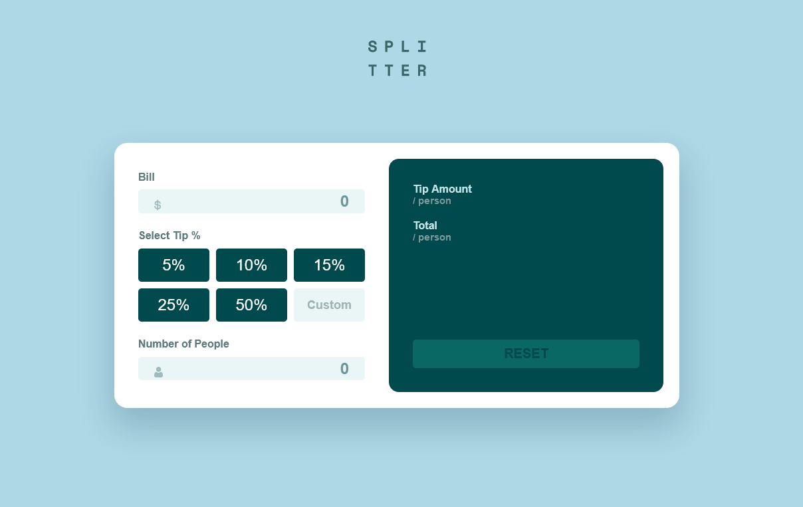

# Frontend Mentor - Tip calculator app solution

This is a solution to the [Tip calculator app challenge on Frontend Mentor](https://www.frontendmentor.io/challenges/tip-calculator-app-ugJNGbJUX). Frontend Mentor challenges help you improve your coding skills by building realistic projects.

## Table of contents

-   [Overview](#overview)
    -   [The challenge](#the-challenge)
    -   [Screenshot](#screenshot)
    -   [Links](#links)
-   [My process](#my-process)
    -   [Built with](#built-with)
    -   [What I learned](#what-i-learned)
    -   [Useful resources](#useful-resources)
-   [Acknowledgments](#acknowledgments)

## Overview

### The challenge

Users should be able to:

-   View the optimal layout for the app depending on their device's screen size
-   See hover states for all interactive elements on the page
-   Calculate the correct tip and total cost of the bill per person

### Screenshot

### Links

-   Live Site URL: [Live version](https://conradmcgrifter.github.io/tip-calculator/)

## My process

I first messed around in codepen to figure out how I was going to do this project [codepen link](https://codepen.io/ConradMcGrifter/pen/ZEKZzeo?editors=1111)

### Built with

vanilla JS + scss

### What I learned

I learned more about validation and learned more in general about javaScript

### Useful resources

-   [resource 1](https://stackoverflow.com/questions/68482512/how-to-round-of-decimal-numbers-and-get-exact-sum-if-added) - this helped me with limiting the number of decimals that get output.
    (using toFixed() method)

-   [resource 2](https://www.w3schools.com/jsref/dom_obj_event.asp)
    this list of HTML DOM events helped me because I wasnt sure how to get the total number to appear on screen as soon as the number of people was entered into the input field. I used the "input" eventListener to achieve this.

-   [resource 3](https://www.w3schools.com/jsref/jsref_parseint.asp)
    learned how to convert an input string to a number so that I can do math with it
